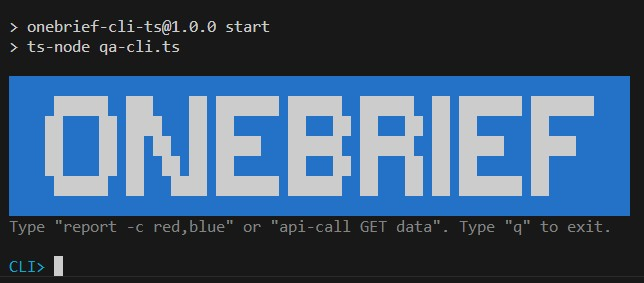

<p align="center">
  
</p>

# QA CLI Tool

This repository contains a robust TypeScript CLI for interacting with a test data API. It provides a clean interface for initiating asynchronous jobs, polling for results, and generating formatted reports directly in the terminal.

The tool features an interactive shell for exploratory use and supports single-command execution for automation. It includes context-aware error handling, strict command validation, and a comprehensive test suite.

> **Note:** This CLI is a client application. It requires the corresponding backend API server (`index.ts`) to be running to function.

## Features

* **Asynchronous Report Generation:** Submits test data (from `GET /data`) to the `POST /test-format` endpoint and polls `POST /retrieve` for the final formatted report.
* **Interactive Mode:** A `readline` shell is initiated when no arguments are provided, allowing for persistent, exploratory use.
* **Direct API Utility:** Includes an `api-call` command to function as a raw HTTP client for debugging existing `GET` and `POST` endpoints.
* **Robust Error Handling:** Intelligently distinguishes between system-level errors (e.g., connection refused) and API-level errors (e.g., 404, 500), providing clear, actionable feedback.
* **Strict Command Validation:** Uses `yargs` to ensure all commands and options are valid, providing helpful error messages to the user.
* **High Test Coverage:** Validated with a comprehensive Jest test suite covering unit logic, command execution, asynchronous polling, and error states.


---

## Prerequisites

* **Node.js** (v14+)
* **Running API Server:** The tool must be able to connect to the backend server. The default target URL is `http://localhost:3000`.

## Installation

1.  **Clone the repository:**
    ```bash
    git clone [https://github.com/yourusername/qa-cli.git](https://github.com/yourusername/qa-cli.git)
    cd qa-cli
    ```

2.  **Install dependencies:**
    ```bash
    npm install
    ```

## Configuration

The target API server URL is configurable via an environment variable.

```bash
# Example: Set the API_URL for the current session
export API_URL="[http://production-api.example.com](http://production-api.example.com)"
```
The default URL is `http://localhost:3000` if the variable is not set.

---

## Usage

The tool can be run as a single command or as an interactive shell.

### Interactive Mode

Run the `start` script without arguments to enter the interactive shell.

```bash
npm start
```

**Output:**


### Single Command Mode

Pass arguments directly to the `npm start` script. Note the use of `--` to separate `npm` arguments from your script's arguments.

```bash
# Generate a report filtered by color
npm start -- report --colors red,blue

# Get server help information
npm start -- api-info

# Make a raw API call
npm start -- api-call GET data
```


---

## Commands

### `report`
Generate a formatted test result report, filtered by color group.

* **Usage:** `npm start -- report [options]`
* **Options:**
    * `--colors`, `-c`: Comma-separated list of test color groups. (Default: `sky-blue`)

### `api-info`
Retrieve and display general help text from the configured server API.

* **Usage:** `npm start -- api-info`

### `api-call`
Execute a raw HTTP request against the server for debugging.

* **Usage:** `npm start -- api-call <method> <endpoint> [options]`
* **Arguments:**
    * `method`: The HTTP method (`GET`, `POST`).
    * `endpoint`: The server path (e.g., `/help` or `/data`).
* **Options:**
    * `--data`, `-d`: A JSON string payload for `POST` requests.

---

## Examples

**Reporting:**
```bash
# Generate a report for "green" and "yellow" groups
npm start -- report -c green,yellow

# Generate a report for a color group with a space
npm start -- report -c "sky blue"
```

**API Interaction:**
```bash
# Retrieve and print the server API documentation
npm start -- api-info

# Fetch and display the raw, unfiltered data set
npm start -- api-call GET data

# Manually check the status of a job ID
npm start -- api-call POST retrieve -d '{"id": "job-uuid-12345"}'
```

---

## Development & Testing

This project uses Jest for unit and integration testing.

**Run all tests:**
```bash
npm test
```

**Generate a coverage report:**
```bash
npm run test:coverage
```
